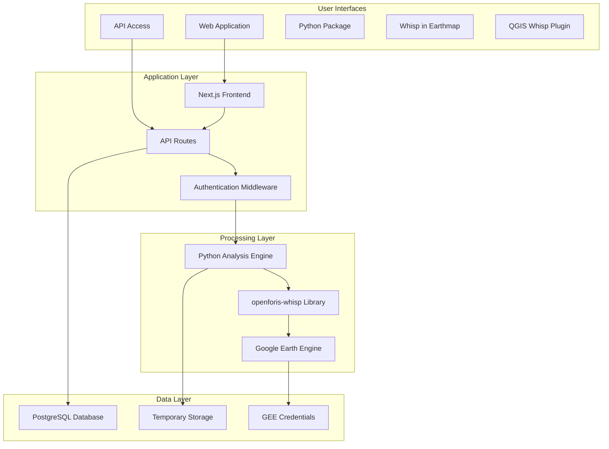
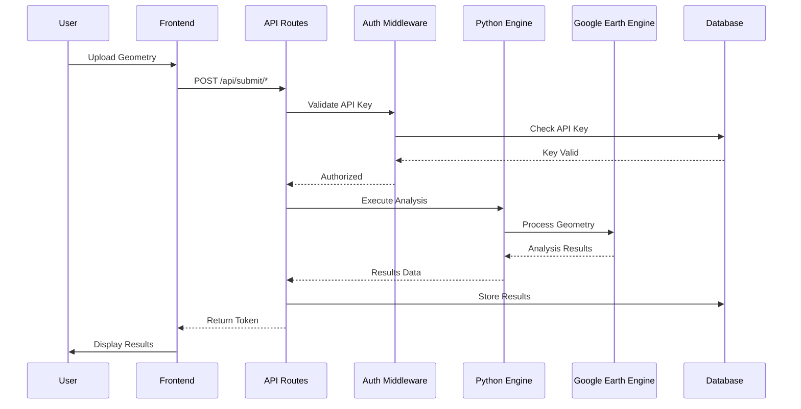

# Whisp: Geospatial Analysis Tool for Zero-Deforestation Claims

## Table of Contents
1. [Overview](#overview)
2. [System Architecture](#system-architecture)
3. [Access Methods](#access-methods)
4. [Technology Stack](#technology-stack)
5. [Setup and Installation](#setup-and-installation)
6. [API Reference](#api-reference)
7. [Python Integration](#python-integration)
8. [License](#license)

## Overview

WHISP is a comprehensive geospatial analysis tool that provides detailed risk assessment for zero-deforestation claims. The system ingests geometries in various formats (WKT, GeoJSON, or Asset Registry GeoIDs) and performs analysis using Google Earth Engine data through the `openforis-whisp` Python library.

**Live Application**: [https://whisp.openforis.org/](https://whisp.openforis.org/)

## System Architecture

### High-Level Architecture



### Component Interaction Flow



## Access Methods

WHISP offers multiple access methods to accommodate different user needs:

| Access Method | Description | Geometry Limit | Best For |
|---------------|-------------|----------------|----------|
| **[Web App](https://whisp.openforis.org/)** | User-friendly interface with interactive map | Currently 500 | Non-technical users, quick assessments |
| **[API](https://whisp.openforis.org/documentation/api-guide)** | Programmatic access with authentication | Currently 500 | Integration with other systems |
| **[Python Package](https://pypi.org/project/openforis-whisp/)** | Direct access via `openforis-whisp` | No limit (depends on GEE quotas) | Data scientists, large datasets |
| **[Whisp in Earthmap](https://whisp.earthmap.org/)** | Visualization-focused interface | Limited (visualization tool) | Visual exploration of specific plots |
| **[QGIS Whisp Plugin](https://plugins.qgis.org/plugins/whisp_plugin/)** | Analyze geometries within QGIS through the Whisp API | Currently 500 | GIS analysts, desktop workflows | 

## Technology Stack

### Frontend Technologies
- **Framework**: Next.js 14.2.26 with React 18
- **Language**: TypeScript 5.8.2
- **Styling**: Tailwind CSS with custom components
- **UI Components**: Radix UI component library
- **Mapping**: Leaflet 1.9.4 with react-leaflet 4.2.1
- **State Management**: Zustand 4.4.7
- **Data Tables**: TanStack Table 8.20.1
- **File Handling**: react-dropzone 14.2.3

### Backend Technologies
- **Runtime**: Node.js with Next.js API routes
- **Database**: PostgreSQL with pg driver 8.14.1
- **Authentication**: JWT tokens via jose 6.0.10
- **Email**: Nodemailer 6.10.0 for verification/reset
- **Python Integration**: Subprocess execution
- **API Documentation**: Swagger UI React 5.21.0
- **Logging**: Winston 3.15.0

### Python Environment
- **Core Library**: `openforis-whisp` for risk assessment
- **Data Processing**: `pandas`, `numpy` for data manipulation
- **Geospatial**: Google Earth Engine API
- **Output Formats**: JSON, CSV, GeoJSON

## Setup and Installation

### Prerequisites
- [Node.js](https://nodejs.org) (v18 or higher)
- [PostgreSQL](https://www.postgresql.org/) (v12 or higher)
- [Python 3.11+](https://www.python.org/downloads/)
- Google Earth Engine service account

### Installation Steps

1. **Clone the Repository**
   ```bash
   git clone https://github.com/openforis/whisp-app.git
   cd whisp-app
   ```

2. **Install Dependencies**

    - Install the whisp Python package and other requirements
      
        ```bash
        pip install -r requirements.txt
        ```
      
    - Install project dependencies  
  
        ```bash
        npm install
        ```

3. **Set Up PostgreSQL Database**

    - Create a new PostgreSQL database for the application
    - Run the database schema scripts located in `src/db/*`
    - Create a database user with appropriate permissions

4. **Environment Configuration**

   - Create `.env.local` file:
   ```env
   # Python Configuration
   PYTHON_PATH=/path/to/your/python
   
   # Database Configuration
   DB_USER=postgres
   DB_HOST=localhost
   DB_NAME=whisp
   DB_PASSWORD=your_password
   DB_PORT=5432
   
   # Authentication
   JWT_SECRET=your_jwt_secret
   
   # Asset Registry
   ASSET_REGISTRY_BASE=https://api-ar.agstack.org
   AR_API_KEY=your_ar_api_key
   AR_CLIENT_SECRET=your_ar_client_secret
   
   # Email Configuration
   EMAIL_SERVICE=smtp.example.com
   EMAIL_USER=user@example.com
   EMAIL_PASS=your_email_password
   
    # Google Maps API Key (for satellite view - with referrer restrictions)
    NEXT_PUBLIC_GOOGLE_MAPS_API_KEY=your_google_maps_api_key_here
    ```

5. **Google Earth Engine Setup**

   - Place your service Google Earth engine account credentials in `credentials.json` at the root directory.

6. **Create Temp Directory**
   ```bash
   mkdir temp
   ```

7. **Run the Application**
   ```bash
   npm run dev
   ```

8. **Create an API Key** (optional for direct API calls)

    - After setting up, register a user account on the application
    - Generate an API key from your user profile
    - Use this API key for authenticated requests to the API endpoints

## API Reference

The Whisp API provides endpoints for user management, data submission, and analysis. The API is protected by authentication middleware. A full, interactive API documentation is available via Swagger UI at the `/documentation/api-guide` endpoint.

The main API endpoints are located in `src/app/api/`.

- **`/api/auth`**: Handles user authentication, including login, registration, password reset, and email verification.
- **`/api/user`**: Manages user profiles and API keys.
- **`/api/submit`**: Accepts geospatial data in various formats (WKT, GeoJSON) for analysis. This endpoint initiates the Python processing script.
- **`/api/temp-key`**: Manages temporary keys for unauthenticated analysis.
- **`/api/generate-geojson`**: Generates GeoJSON output from analysis results.
- **`/api/report`**: Creates and serves analysis reports.
- **`/api/download-csv`**: Allows downloading analysis results as a CSV file.

## Python Integration

### Analysis Engine

The Python analysis is handled by `src/python/analysis.py`:

```python
import openforis_whisp as whisp
import pandas as pd

# Initialize Google Earth Engine
whisp.initialize_ee(CREDENTIAL_PATH)

def main(file_path, legacy_mode=False):
    # Process geometry data
    whisp_df = whisp.whisp_formatted_stats_geojson_to_df(
        file_path, 
        national_codes=['co', 'ci', 'br']
    )
    
    # Perform risk assessment
    whisp_df_risk = whisp.whisp_risk(
        whisp_df, 
        national_codes=['co', 'ci', 'br']
    )
    
    # Export results
    whisp_df_risk.to_csv(csv_file_path, index=False)
    whisp.convert_df_to_geojson(whisp_df_risk, json_file_path)
```

### Integration Flow

1. User submits geometry via web interface
2. Next.js API validates input and authentication
3. Geometry is saved to temporary file
4. Python script is executed via subprocess
5. Results are processed and stored
6. User receives analysis results

## License

[MIT](https://choosealicense.com/licenses/mit/)

---

Built with ❤️ for forests and biodiversity.
