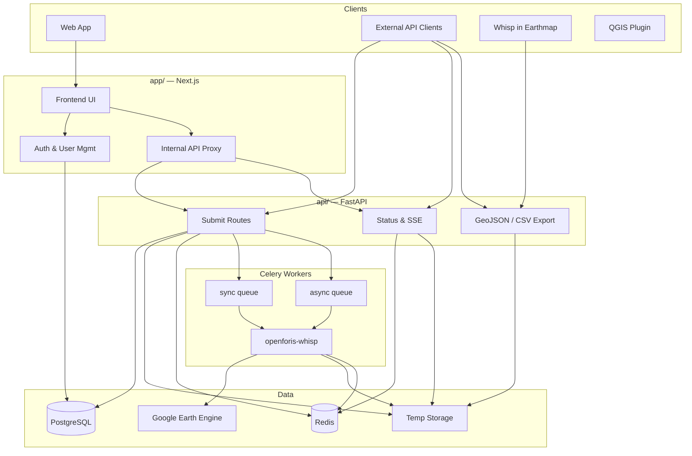
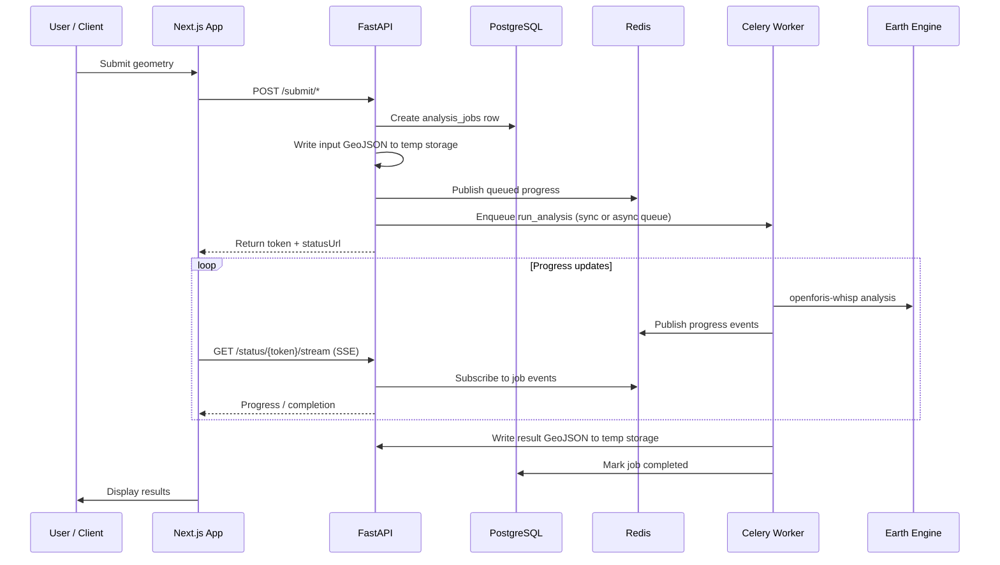

# Whisp: Geospatial Analysis Tool for Zero-Deforestation Claims

## Table of Contents
1. [Overview](#overview)
2. [System Architecture](#system-architecture)
3. [Access Methods](#access-methods)
4. [Technology Stack](#technology-stack)
5. [Setup and Installation](#setup-and-installation)
6. [API Reference](#api-reference)
7. [Python Integration](#python-integration)
8. [License](#license)

## Overview

WHISP is a comprehensive geospatial analysis tool that provides detailed risk assessment for zero-deforestation claims. The system ingests geometries in various formats (WKT, GeoJSON, or GeoIDs) and performs analysis using Google Earth Engine data through the `openforis-whisp` Python library.

**Live Application**: [https://whisp.openforis.org/](https://whisp.openforis.org/)

## System Architecture

The application is split into independently deployable services:

| Component | Path | Role |
|-----------|------|------|
| **App** | `app/` | Next.js web UI — auth, account management, geometry submission, results viewer |
| **API** | `api/` | FastAPI service — submit, status, GeoJSON/CSV export |
| **Workers** | `api/` (Celery) | Background analysis — runs `openforis-whisp` against Google Earth Engine |
| **Database** | `db/` | PostgreSQL schema and migrations |
| **Infra** | `infra/k8s/` | GKE manifests (API, app, sync/async workers, Redis, Cloud SQL proxy) |

### High-Level Architecture


```mermaid
graph TB
    subgraph Clients
        UI[Web App]
        EXT[External API Clients]
        MAP[Whisp in Earthmap]
        QGIS[QGIS Plugin]
    end

    subgraph App["app/ — Next.js"]
        FE[Frontend UI]
        AUTH[Auth & User Mgmt]
        PROXY[Internal API Proxy]
    end

    subgraph API["api/ — FastAPI"]
        SUBMIT[Submit Routes]
        STATUS[Status & SSE]
        EXPORT[GeoJSON / CSV Export]
    end

    subgraph Workers["Celery Workers"]
        SYNC[sync queue]
        ASYNC[async queue]
        WHISP[openforis-whisp]
    end

    subgraph Data
        PG[(PostgreSQL)]
        REDIS[(Redis)]
        TEMP[Temp Storage]
        GEE[Google Earth Engine]
    end

    UI --> FE
    FE --> AUTH
    FE --> PROXY
    PROXY --> SUBMIT
    PROXY --> STATUS
    EXT --> SUBMIT
    EXT --> STATUS
    EXT --> EXPORT
    MAP --> EXPORT

    SUBMIT --> PG
    SUBMIT --> TEMP
    SUBMIT --> REDIS
    SUBMIT --> SYNC
    SUBMIT --> ASYNC
    SYNC --> WHISP
    ASYNC --> WHISP
    WHISP --> GEE
    WHISP --> TEMP
    WHISP --> REDIS
    STATUS --> REDIS
    STATUS --> TEMP
    EXPORT --> TEMP
    AUTH --> PG
```

### Analysis Job Flow


```mermaid
sequenceDiagram
    participant U as User / Client
    participant APP as Next.js App
    participant API as FastAPI
    participant DB as PostgreSQL
    participant R as Redis
    participant W as Celery Worker
    participant GEE as Earth Engine

    U->>APP: Submit geometry
    APP->>API: POST /submit/*
    API->>DB: Create analysis_jobs row
    API->>API: Write input GeoJSON to temp storage
    API->>R: Publish queued progress
    API->>W: Enqueue run_analysis (sync or async queue)
    API-->>APP: Return token + statusUrl

    loop Progress updates
        W->>GEE: openforis-whisp analysis
        W->>R: Publish progress events
        APP->>API: GET /status/{token}/stream (SSE)
        API->>R: Subscribe to job events
        API-->>APP: Progress / completion
    end

    W->>API: Write result GeoJSON to temp storage
    W->>DB: Mark job completed
    APP->>U: Display results
```

### Key Design Notes

- **Token = one analysis job**, not one plot. A batch submission (multi-feature GeoJSON) produces a single token containing results for all features.
- **Results are ephemeral.** Output files live in temp storage; job progress snapshots in Redis expire after 10 minutes. WHISP does not provide long-term result storage — integrators should persist GeoJSON/CSV themselves if needed.
- **Two worker queues:** `sync` for small, inline requests; `async` for larger batches (uses the Earth Engine high-volume endpoint).
- **Shared PostgreSQL** stores users, API keys, rate limits, analysis job metadata, and reference data (result fields, commodities).
- **Production deployment** runs API, app, sync worker, async worker, Redis, and Cloud SQL proxy as separate GKE workloads. Temp storage is mounted via GCS FUSE.

## Access Methods

WHISP offers multiple access methods to accommodate different user needs:

| Access Method | Description | Best For |
|---------------|-------------|----------|
| **[Web App](https://whisp.openforis.org/)** | User-friendly interface with interactive map | Non-technical users, quick assessments |
| **[API](https://whisp.openforis.org/api/docs)** | Programmatic access with API key | Integration with other systems |
| **[Python Package](https://pypi.org/project/openforis-whisp/)** | Direct access via `openforis-whisp` | Data scientists, large datasets |
| **[Whisp in Earthmap](https://whisp.earthmap.org/)** | Visualization-focused interface | Visual exploration of specific plots |
| **[QGIS Whisp Plugin](https://plugins.qgis.org/plugins/whisp_plugin/)** | Analyze geometries within QGIS through the Whisp API | GIS analysts, desktop workflows |

Geometry limits for the web app and API are runtime-configurable and exposed via `GET /config`.

## Technology Stack

### App (`app/`)
- **Framework**: Next.js 16 with React 19
- **Language**: TypeScript 5
- **Styling**: Tailwind CSS 4
- **Mapping**: Leaflet with react-leaflet
- **Database**: PostgreSQL via `pg`
- **Authentication**: JWT (jose), server actions

### API & Workers (`api/`)
- **Framework**: FastAPI with Uvicorn
- **Task queue**: Celery with Redis broker
- **Database**: PostgreSQL via asyncpg
- **Analysis**: `openforis-whisp`, Google Earth Engine API
- **Observability**: Prometheus metrics, structured JSON logging

### Database (`db/`)
- PostgreSQL migrations managed via Node.js runner (`npm run migrate`)

## Setup and Installation

### Prerequisites
- [Node.js](https://nodejs.org) v18+
- [Python 3.11+](https://www.python.org/downloads/)
- [PostgreSQL](https://www.postgresql.org/) v12+
- [Redis](https://redis.io/)
- Google Earth Engine service account

### Quick Start (local dev)

```bash
git clone https://github.com/openforis/whisp-app.git
cd whisp-app

# Install app + API dependencies
bash scripts/dev/linux/setup.sh    # or scripts/dev/windows/setup.ps1

# Configure environment (see app/.env.example and api/.env.example)
# Place GEE credentials at api/credentials.json

# Run database migrations
cd db && npm install && npm run migrate

# Start API, workers, Redis, and Next.js dev server
bash scripts/dev/linux/start.sh    # or scripts/dev/windows/start.ps1
```

Default local URLs:
- App: `http://localhost:3001`
- API: `http://localhost:8001`
- API docs: `http://localhost:8001/api/docs`

### Environment Configuration

**App** (`app/.env.local`):
```env
JWT_SECRET=
API_URL=http://localhost:8001/api
DB_HOST=localhost
DB_PORT=5432
DB_NAME=whisp_db
DB_USER=
DB_PASSWORD=
HOST_URL=http://localhost:3001
```

`API_URL` is the server-to-server API base used by server code only (it never
reaches the browser). Browser-facing URLs (quick-start cURL, footer API docs
link, Whisp map download) use the **public** API base, which defaults to
`API_URL`. Set `PUBLIC_API_URL` only when `API_URL` is not publicly reachable —
e.g. in Kubernetes set `API_URL` to the internal cluster service URL
(`http://whisp-api:8000/api`) to skip an ingress roundtrip, and
`PUBLIC_API_URL` to the externally reachable URL.

**API** (`api/.env.local`):
```env
TEMP_DIR=./temp
EE_CREDENTIAL_PATH=./credentials.json
REDIS_URL=redis://localhost:6379
DB_HOST=localhost
DB_PORT=5432
DB_NAME=whisp_db
DB_USER=
DB_PASSWORD=
ALLOWED_ORIGINS=http://localhost:3001
GEOID_BASE_URL=https://data.review.fao.org/geoid
GEOID_COLLECTION=
```

`GEOID_BASE_URL` is the GeoID service root. GeoIDs are resolved with `GET {GEOID_BASE_URL}/{geoid}`. The app loads collections from `GET {GEOID_BASE_URL}/collections`. `GEOID_COLLECTION` is an optional default for the collection picker in the UI.

## API Reference

The Whisp API is a FastAPI service. Interactive documentation is available at `/api/docs` (Swagger) and `/api/redoc`.

All analysis endpoints require an `X-API-KEY` header.

| Endpoint | Method | Description |
|----------|--------|-------------|
| `/submit/geojson` | POST | Submit a GeoJSON FeatureCollection for analysis |
| `/submit/wkt` | POST | Submit a WKT geometry for analysis |
| `/submit/geo-ids` | POST | Submit GeoIDs for analysis |
| `/status/{token}` | GET | Poll job status; returns result GeoJSON when complete |
| `/status/{token}/stream` | GET | Server-sent events stream for live progress |
| `/status/{token}/cancel` | POST | Cancel a running analysis |
| `/generate-geojson/{token}` | GET | Download result as GeoJSON (public, no auth) |
| `/download-csv/{token}` | GET | Download result as CSV |
| `/config` | GET | Public runtime configuration |
| `/health` | GET | Health check |

Routes are also available under the `/api` prefix (e.g. `/api/submit/geojson`).

The Next.js app proxies authenticated submit and status calls through `/internal/submit/*` and `/internal/status/*` so browser sessions can use the user's API key without exposing it client-side.

## Python Integration

Analysis runs inside Celery workers via `api/src/worker/tasks.py`:

```python
import openforis_whisp as whisp

whisp.initialize_ee(credential_path, use_high_vol_endpoint=async_mode)

stats_df = whisp.whisp_formatted_stats_geojson_to_df(
    input_file,
    mode="concurrent" if async_mode else "sequential",
    national_codes=["co", "ci", "br"],
)

risk_df = whisp.whisp_risk(stats_df, national_codes=["co", "ci", "br"])
whisp.convert_df_to_geojson(risk_df, result_file)
```

Workers publish progress to Redis during execution. On completion, the result GeoJSON is written to temp storage and the job record in PostgreSQL is updated.

For direct library use without the API, see the [openforis-whisp package](https://pypi.org/project/openforis-whisp/).

## License

[MIT](https://choosealicense.com/licenses/mit/)

---

Built with ❤️ for forests and biodiversity.
