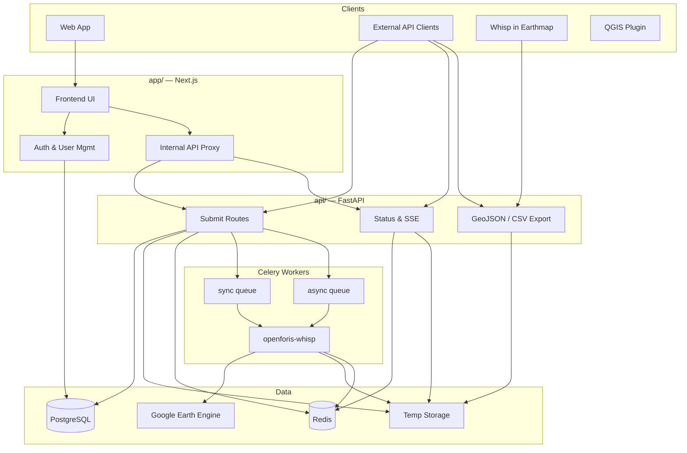
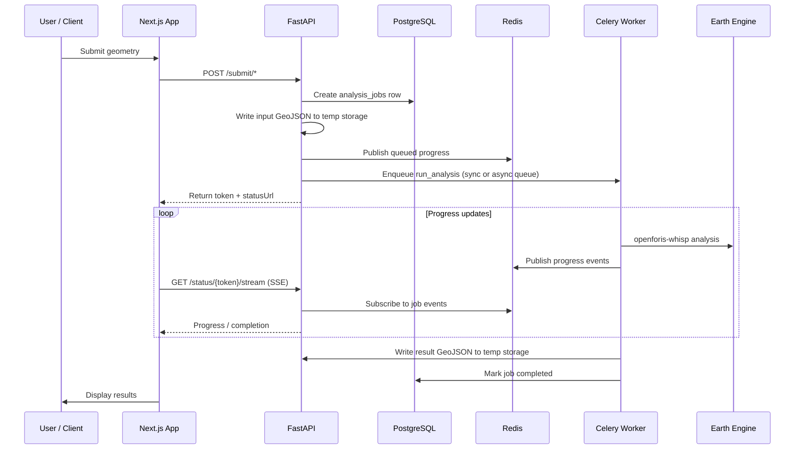
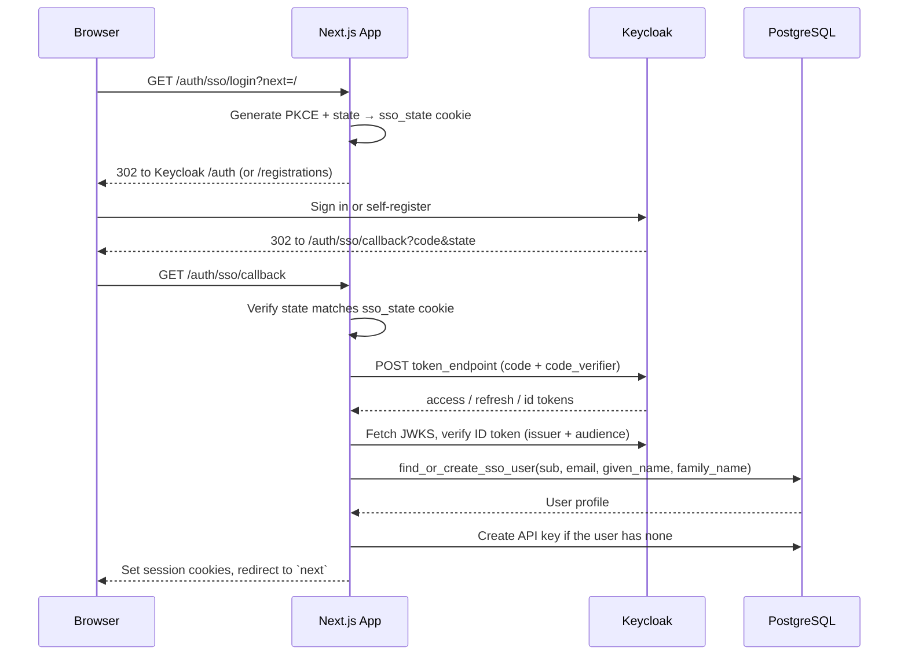

# Whisp: Geospatial Analysis Tool for Zero-Deforestation Claims

## Table of Contents
1. [Overview](#overview)
2. [System Architecture](#system-architecture)
3. [Access Methods](#access-methods)
4. [Authentication and User Registration](#authentication-and-user-registration)
5. [Technology Stack](#technology-stack)
6. [Setup and Installation](#setup-and-installation)
7. [API Reference](#api-reference)
8. [Python Integration](#python-integration)
9. [License](#license)

## Overview

WHISP is a comprehensive geospatial analysis tool that provides detailed risk assessment for zero-deforestation claims. The system ingests geometries in various formats (WKT, GeoJSON, or GeoIDs) and performs analysis using Google Earth Engine data through the `openforis-whisp` Python library.

**Live Application**: [https://whisp.openforis.org/](https://whisp.openforis.org/)

## System Architecture

The application is split into independently deployable services:

| Component | Path | Role |
|-----------|------|------|
| **App** | `app/` | Next.js web UI — Keycloak SSO, account management, geometry submission, results viewer |
| **API** | `api/` | FastAPI service — submit, status, GeoJSON/CSV export |
| **Workers** | `api/` (Celery) | Background analysis — runs `openforis-whisp` against Google Earth Engine |
| **Database** | `db/` | PostgreSQL schema and migrations |
| **Infra** | `infra/k8s/` | GKE manifests (API, app, sync/async workers, Redis, Cloud SQL proxy) |

### High-Level Architecture


```mermaid
graph TB
    subgraph Clients
        UI[Web App]
        EXT[External API Clients]
        MAP[Whisp in Earthmap]
        QGIS[QGIS Plugin]
    end

    subgraph App["app/ — Next.js"]
        FE[Frontend UI]
        AUTH[Auth & User Mgmt]
        PROXY[Internal API Proxy]
    end

    subgraph API["api/ — FastAPI"]
        SUBMIT[Submit Routes]
        STATUS[Status & SSE]
        EXPORT[GeoJSON / CSV Export]
    end

    subgraph Workers["Celery Workers"]
        SYNC[sync queue]
        ASYNC[async queue]
        WHISP[openforis-whisp]
    end

    subgraph Data
        PG[(PostgreSQL)]
        REDIS[(Redis)]
        TEMP[Temp Storage]
        GEE[Google Earth Engine]
    end

    UI --> FE
    FE --> AUTH
    FE --> PROXY
    PROXY --> SUBMIT
    PROXY --> STATUS
    EXT --> SUBMIT
    EXT --> STATUS
    EXT --> EXPORT
    MAP --> EXPORT

    SUBMIT --> PG
    SUBMIT --> TEMP
    SUBMIT --> REDIS
    SUBMIT --> SYNC
    SUBMIT --> ASYNC
    SYNC --> WHISP
    ASYNC --> WHISP
    WHISP --> GEE
    WHISP --> TEMP
    WHISP --> REDIS
    STATUS --> REDIS
    STATUS --> TEMP
    EXPORT --> TEMP
    AUTH --> PG
```

### Analysis Job Flow


```mermaid
sequenceDiagram
    participant U as User / Client
    participant APP as Next.js App
    participant API as FastAPI
    participant DB as PostgreSQL
    participant R as Redis
    participant W as Celery Worker
    participant GEE as Earth Engine

    U->>APP: Submit geometry
    APP->>API: POST /submit/*
    API->>DB: Create analysis_jobs row
    API->>API: Write input GeoJSON to temp storage
    API->>R: Publish queued progress
    API->>W: Enqueue run_analysis (sync or async queue)
    API-->>APP: Return token + statusUrl

    loop Progress updates
        W->>GEE: openforis-whisp analysis
        W->>R: Publish progress events
        APP->>API: GET /status/{token}/stream (SSE)
        API->>R: Subscribe to job events
        API-->>APP: Progress / completion
    end

    W->>API: Write result GeoJSON to temp storage
    W->>DB: Mark job completed
    APP->>U: Display results
```

### Key Design Notes

- **Token = one analysis job**, not one plot. A batch submission (multi-feature GeoJSON) produces a single token containing results for all features.
- **Results are ephemeral.** Output files live in temp storage; job progress snapshots in Redis expire after 10 minutes. WHISP does not provide long-term result storage — integrators should persist GeoJSON/CSV themselves if needed.
- **Two worker queues:** `sync` for small, inline requests; `async` for larger batches (uses the Earth Engine high-volume endpoint).
- **Shared PostgreSQL** stores users, API keys, rate limits, analysis job metadata, and reference data (result fields, commodities).
- **Production deployment** runs API, app, sync worker, async worker, Redis, and Cloud SQL proxy as separate GKE workloads. Temp storage is mounted via GCS FUSE.

## Access Methods

WHISP offers multiple access methods to accommodate different user needs:

| Access Method | Description | Best For |
|---------------|-------------|----------|
| **[Web App](https://whisp.openforis.org/)** | User-friendly interface with interactive map | Non-technical users, quick assessments |
| **[API](https://whisp.openforis.org/api/docs)** | Programmatic access with API key | Integration with other systems |
| **[Python Package](https://pypi.org/project/openforis-whisp/)** | Direct access via `openforis-whisp` | Data scientists, large datasets |
| **[Whisp in Earthmap](https://whisp.earthmap.org/)** | Visualization-focused interface | Visual exploration of specific plots |
| **[QGIS Whisp Plugin](https://plugins.qgis.org/plugins/whisp_plugin/)** | Analyze geometries within QGIS through the Whisp API | GIS analysts, desktop workflows |

Geometry limits for the web app and API are runtime-configurable and exposed via `GET /config`.

## Authentication and User Registration

There are two independent mechanisms, and they do not overlap:

- **Keycloak SSO** authenticates people in the browser and creates the app session.
- **Whisp-issued API keys** authenticate programmatic calls to the API. Users generate their own key inside the app after signing in.

Sign-in uses the OIDC authorization code flow with PKCE. The Next.js app is the OIDC client; Keycloak owns credentials, email verification, and password resets. Local password login still exists for legacy accounts but is deprecated — any account linked to Keycloak is redirected to SSO instead.

### SSO routes (`app/src/app/auth/sso/`)

| Route | Purpose |
|-------|---------|
| `GET /auth/sso/login` | Starts sign-in. Generates PKCE verifier + `state`, stores them in a short-lived `sso_state` cookie, redirects to Keycloak's `authorization_endpoint`. Accepts `next` (post-login path) and `login_hint` (prefills the email). |
| `GET /auth/sso/register` | Same as login, but redirects to Keycloak's `/registrations` page so the user self-registers. |
| `GET /auth/sso/callback` | Keycloak redirect target. Validates `state`, exchanges the code for tokens, verifies the ID token, provisions the user, sets session cookies. |
| `GET /auth/sso/logout` | Clears app cookies and redirects to Keycloak's `end_session_endpoint` (RP-initiated logout) so the IdP session ends too. |
| `GET /auth/sso/account` | Redirects to the Keycloak account console for profile/password/MFA management. |

All SSO routes return `501` when Keycloak is not configured.

### Sign-in flow


```mermaid
sequenceDiagram
    participant U as Browser
    participant APP as Next.js App
    participant KC as Keycloak
    participant DB as PostgreSQL

    U->>APP: GET /auth/sso/login?next=/
    APP->>APP: Generate PKCE + state → sso_state cookie
    APP-->>U: 302 to Keycloak /auth (or /registrations)
    U->>KC: Sign in or self-register
    KC-->>U: 302 to /auth/sso/callback?code&state
    U->>APP: GET /auth/sso/callback
    APP->>APP: Verify state matches sso_state cookie
    APP->>KC: POST token_endpoint (code + code_verifier)
    KC-->>APP: access / refresh / id tokens
    APP->>KC: Fetch JWKS, verify ID token (issuer + audience)
    APP->>DB: find_or_create_sso_user(sub, email, given_name, family_name)
    DB-->>APP: User profile
    APP->>DB: Create API key if the user has none
    APP-->>U: Set session cookies, redirect to `next`
```

### Registering new users

There is no local sign-up form. `/register` and the navbar "Register" button both redirect to `/auth/sso/register`, which sends the user to Keycloak's self-registration page. Accounts are created in the Whisp database lazily, on the first successful callback — the `find_or_create_sso_user` SQL function (`db/migrations/20260713_keycloak_sso/`) resolves the user in three cases:

1. **Known `keycloak_sub`** → return the existing profile.
2. **Known email, no `keycloak_sub`** → link the legacy local account to Keycloak and mark the email verified. (If the email is already linked to a *different* `sub`, the function raises and sign-in fails.)
3. **Unknown email** → insert a new user with `password_hash = NULL`, `email_verified = TRUE`, and the Keycloak `sub`.

Because Keycloak has already verified the address, SSO users skip Whisp's email-verification step.

### API keys

**Keycloak tokens never reach the API.** SSO only establishes the browser session with the Next.js app; API access uses a separate Whisp-issued API key that the user generates in the app. Keycloak has no part in issuing, validating, or revoking it.

Keys are plain UUIDs stored in the `api_keys` table, minted by `createApiKeyForUser` (`app/src/lib/db/api-keys-service.ts`) and valid for **365 days**. A user has at most **one active key** — `create_or_replace_api_key` replaces any existing one, so regenerating immediately invalidates the old key.

Users manage their key from the **account page**, backed by the server actions in `app/src/lib/auth/api-key-actions.ts`:

| Action | Server action | Effect |
|--------|---------------|--------|
| Generate | `createUserApiKey` | Creates a key when none is active. Shown once, in full. |
| Regenerate | `createUserApiKey` | Replaces the current key; existing integrations break immediately. |
| Revoke | `deleteUserApiKey` | Leaves the account with no active key; all API calls fail until a new one is generated. |

Two conveniences worth knowing:

- On the first SSO callback, the app generates a key automatically if the user has none, so a newly registered account can call the API without a manual step.
- Submissions made through the web UI are gated on having an active key (`hasApiKey`); the app's `/internal/submit/*` and `/internal/status/*` proxies attach the session user's key server-side, so it is never embedded in client-side code.

Direct API calls pass the key as an `X-API-KEY` header — see [API Reference](#api-reference). Rate limits and concurrency caps are attached to the key record, not to the SSO identity.

### Session and cookies

| Cookie | Contents | Lifetime |
|--------|----------|----------|
| `token` | App JWT (HS256, signed with `JWT_SECRET`) | 30 min |
| `refreshToken` | App refresh JWT — silently mints a new access token | 7 days |
| `kc_refresh_token` | Keycloak refresh token, used for RP-initiated logout | 30 days |
| `sso_state` | `state` + PKCE verifier + `next` path, during the redirect only | 5 min |

All are `httpOnly`, `secure` in production, and `sameSite=strict` (`sso_state` uses `lax` so it survives the redirect back from Keycloak).

### Configuration

SSO activates only when both `KEYCLOAK_ISSUER` and `KEYCLOAK_CLIENT_ID` are set. The redirect URI is derived from `HOST_URL` as `{HOST_URL}/auth/sso/callback` — register exactly that value as a valid redirect URI on the Keycloak client, and `{HOST_URL}/` as a valid post-logout redirect URI. See [Environment Configuration](#environment-configuration) for the variables.

## Technology Stack

### App (`app/`)
- **Framework**: Next.js 16 with React 19
- **Language**: TypeScript 5
- **Styling**: Tailwind CSS 4
- **Mapping**: Leaflet with react-leaflet
- **Database**: PostgreSQL via `pg`
- **Authentication**: Keycloak OIDC SSO (authorization code + PKCE), app session JWTs via `jose`, server actions

### API & Workers (`api/`)
- **Framework**: FastAPI with Uvicorn
- **Task queue**: Celery with Redis broker
- **Database**: PostgreSQL via asyncpg
- **Analysis**: `openforis-whisp`, Google Earth Engine API
- **Observability**: Prometheus metrics, structured JSON logging

### Database (`db/`)
- PostgreSQL migrations managed via Node.js runner (`npm run migrate`)

## Setup and Installation

### Prerequisites
- [Node.js](https://nodejs.org) v18+
- [Python 3.11+](https://www.python.org/downloads/)
- [PostgreSQL](https://www.postgresql.org/) v12+
- [Redis](https://redis.io/)
- Google Earth Engine service account

### Quick Start (local dev)

```bash
git clone https://github.com/forestdatapartnership/whisp-app.git
cd whisp-app

# Install app + API dependencies
bash scripts/dev/linux/setup.sh    # or scripts/dev/windows/setup.ps1

# Configure environment (see app/.env.example and api/.env.example)
# Place GEE credentials at api/credentials.json

# Run database migrations
cd db && npm install && npm run migrate

# Start API, workers, Redis, and Next.js dev server
bash scripts/dev/linux/start.sh    # or scripts/dev/windows/start.ps1
```

Default local URLs:
- App: `http://localhost:3001`
- API: `http://localhost:8001`
- API docs: `http://localhost:8001/api/docs`

### Environment Configuration

**App** (`app/.env.local`):
```env
JWT_SECRET=
API_URL=http://localhost:8001/api
DB_HOST=localhost
DB_PORT=5432
DB_NAME=whisp_db
DB_USER=
DB_PASSWORD=
HOST_URL=http://localhost:3001

# Keycloak SSO — set both to enable; omit to disable SSO routes
KEYCLOAK_ISSUER=https://<keycloak-host>/realms/<realm>
KEYCLOAK_CLIENT_ID=
KEYCLOAK_CLIENT_SECRET=      # optional — omit for a public PKCE client
KEYCLOAK_SCOPE=              # optional — defaults to "openid email profile"
```

`HOST_URL` drives the OIDC redirect URI (`{HOST_URL}/auth/sso/callback`), so it
must match the public origin of the app and be registered on the Keycloak
client. See [Authentication and User Registration](#authentication-and-user-registration).

`API_URL` is the server-to-server API base used by server code only (it never
reaches the browser). Browser-facing URLs (quick-start cURL, footer API docs
link, Whisp map download) use the **public** API base, which defaults to
`API_URL`. Set `PUBLIC_API_URL` only when `API_URL` is not publicly reachable —
e.g. in Kubernetes set `API_URL` to the internal cluster service URL
(`http://whisp-api:8000/api`) to skip an ingress roundtrip, and
`PUBLIC_API_URL` to the externally reachable URL.

**API** (`api/.env.local`):
```env
TEMP_DIR=./temp
EE_CREDENTIAL_PATH=./credentials.json
REDIS_URL=redis://localhost:6379
DB_HOST=localhost
DB_PORT=5432
DB_NAME=whisp_db
DB_USER=
DB_PASSWORD=
ALLOWED_ORIGINS=http://localhost:3001
GEOID_BASE_URL=https://data.review.fao.org/geoid
GEOID_COLLECTION=
```

`GEOID_BASE_URL` is the GeoID service root. GeoIDs are resolved with `GET {GEOID_BASE_URL}/{geoid}`. The app loads collections from `GET {GEOID_BASE_URL}/collections`. `GEOID_COLLECTION` is an optional default for the collection picker in the UI.

## API Reference

The Whisp API is a FastAPI service. Interactive documentation is available at `/api/docs` (Swagger) and `/api/redoc`.

All analysis endpoints require an `X-API-KEY` header. The key is issued by the Whisp app, not by the SSO provider — sign in and generate one from your account page (see [API keys](#api-keys)). Keycloak access tokens are not accepted by the API.

| Endpoint | Method | Description |
|----------|--------|-------------|
| `/submit/geojson` | POST | Submit a GeoJSON FeatureCollection for analysis |
| `/submit/wkt` | POST | Submit a WKT geometry for analysis |
| `/submit/geo-ids` | POST | Submit GeoIDs for analysis |
| `/status/{token}` | GET | Poll job status; returns result GeoJSON when complete |
| `/status/{token}/stream` | GET | Server-sent events stream for live progress |
| `/status/{token}/cancel` | POST | Cancel a running analysis |
| `/generate-geojson/{token}` | GET | Download result as GeoJSON (public, no auth) |
| `/download-csv/{token}` | GET | Download result as CSV |
| `/config` | GET | Public runtime configuration |
| `/health` | GET | Health check |

Routes are also available under the `/api` prefix (e.g. `/api/submit/geojson`).

The Next.js app proxies authenticated submit and status calls through `/internal/submit/*` and `/internal/status/*` so browser sessions can use the user's API key without exposing it client-side.

## Python Integration

Analysis runs inside Celery workers via `api/src/worker/tasks.py`:

```python
import openforis_whisp as whisp

whisp.initialize_ee(credential_path, use_high_vol_endpoint=async_mode)

stats_df = whisp.whisp_formatted_stats_geojson_to_df(
    input_file,
    mode="concurrent" if async_mode else "sequential",
    national_codes=["co", "ci", "br"],
)

risk_df = whisp.whisp_risk(stats_df, national_codes=["co", "ci", "br"])
whisp.convert_df_to_geojson(risk_df, result_file)
```

Workers publish progress to Redis during execution. On completion, the result GeoJSON is written to temp storage and the job record in PostgreSQL is updated.

For direct library use without the API, see the [openforis-whisp package](https://pypi.org/project/openforis-whisp/).

## License

[MIT](https://choosealicense.com/licenses/mit/)

---

Built with ❤️ for forests and biodiversity.
